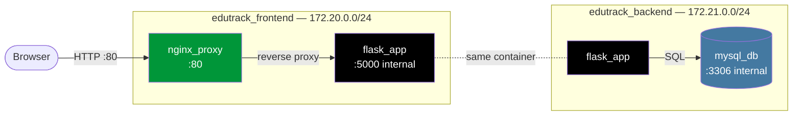
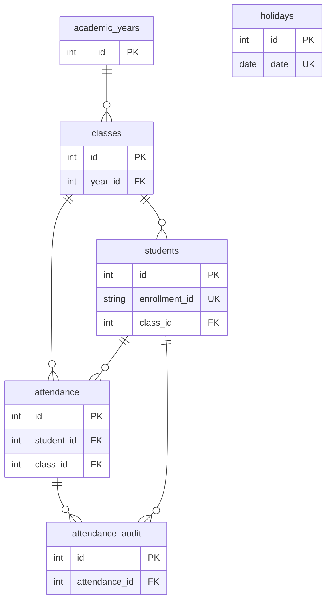
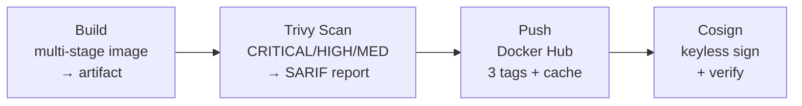

# EduTrack — Containerized Student Attendance Management System

> A production-style, fully containerized web application for managing student attendance — replacing fragile Excel sheets with a proper multi-service Docker architecture.

<p align="left">
  
  
  
  
  
  
</p>

Built for the subject **Container-Based Application Development (23CSE3147)**. The focus is on demonstrating real-world Docker concepts — multi-stage builds, network segmentation, secrets, health checks, image signing, and a full CI/CD pipeline — on top of a genuinely useful application.

---

## Table of Contents

- [Features](#features)
- [Architecture](#architecture)
- [Tech Stack](#tech-stack)
- [Docker Concepts Demonstrated](#docker-concepts-demonstrated)
- [Prerequisites](#prerequisites)
- [Quick Start](#quick-start)
- [Monitoring Stack (Optional)](#monitoring-stack-optional)
- [Project Structure](#project-structure)
- [Database Schema](#database-schema)
- [CI/CD Pipeline](#cicd-pipeline)
- [Security](#security)
- [Verifying the Published Image](#verifying-the-published-image)
- [Troubleshooting](#troubleshooting)
- [License](#license)

---

## Features

| Module | Capabilities |
|--------|--------------|
| **Dashboard** | Total students & classes, today's attendance %, defaulters count, 7-day trend chart (Chart.js), at-risk students list |
| **Students** | List, search, filter by class, add (auto-generates `MIT-YYYY-XXX` enrollment IDs), edit, delete, **bulk CSV import** with a downloadable template |
| **Classes** | Create / delete classes, each with its own defaulter threshold and capacity |
| **Attendance** | Pick a class + date, AJAX-load the roster, Present/Absent toggle, "Mark All" buttons; duplicates prevented via `ON DUPLICATE KEY UPDATE` |
| **History** | Filter by class + date range, edit past records (reason required → written to an **audit trail**) |
| **Defaulters** | Auto-detected students below their class threshold, exportable as CSV |
| **Reports** | Date-range filter, live preview, CSV export |
| **Holidays** | Excluded from attendance percentage calculations |

---

## Architecture

Three containers orchestrated by Docker Compose, split across **two segmented bridge networks**. The database is reachable **only** by the app — Nginx has no route to it.



**Request flow:** `Browser → Nginx → Flask → MySQL → Flask → Nginx → Browser`

| Container | Image | Ports | Networks | Notes |
|-----------|-------|-------|----------|-------|
| `nginx_proxy` | `nginx:alpine` | `80:80` (public) | frontend | Entry point / reverse proxy |
| `flask_app` | built from `Dockerfile` | `5000` (internal only) | frontend + backend | The only service that bridges both networks |
| `mysql_db` | `mysql:8.0` | `3306` (internal only) | backend | **Not** on the frontend network — Nginx cannot reach it |

> **Why two networks?** Network segmentation means a compromise of the public-facing Nginx container gives no direct path to the database. Flask is the only authorized bridge.

---

## Tech Stack

- **Backend:** Python 3.11 · Flask 3.0 · Gunicorn (2 workers)
- **Database:** MySQL 8.0
- **Frontend:** Jinja2 templates · Tailwind CSS (CDN) · Chart.js
- **Reverse Proxy:** Nginx (alpine)
- **Supply-chain security:** [Trivy](https://github.com/aquasecurity/trivy) (CVE scanning) · [Cosign](https://github.com/sigstore/cosign) (keyless image signing)
- **Observability:** Loki · Promtail · Grafana
- **CI/CD:** GitHub Actions → Docker Hub (`premmaradiya/studentmanagement-web`)

---

## Docker Concepts Demonstrated

This project is intentionally built to showcase the breadth of the course:

- **Multi-stage Dockerfile** — a `builder` stage compiles dependencies; the `final` stage (`python:3.11-slim`) copies only the installed packages → smaller, cleaner image
- **Non-root container** — runs as a dedicated `appuser`, not root
- **Named volume** (`edutrack_mysql_data`) for MySQL persistence
- **Read-only bind mounts** for `nginx.conf` and `init.sql` (`:ro`)
- **Docker secrets** (`db_password`, `db_root_password`) mounted at `/run/secrets/` — never baked into images or env vars
- **Health checks** on all three containers
- **`depends_on` with `condition: service_healthy`** — Flask waits until MySQL is genuinely ready
- **Log rotation** via the `json-file` driver (`max-size: 10m`, `max-file: 3`)
- **`.dockerignore` + `.gitignore`** keep secrets out of both images and git
- **Custom bridge networks** with explicit subnets for segmentation

---

## Prerequisites

- [Docker Desktop](https://www.docker.com/products/docker-desktop/) (with Docker Compose v2)
- ~2 GB free disk space for images
- Ports **80** (Nginx) and — if you enable monitoring — **3000** (Grafana) free

---

## Quick Start

> **First-time setup requires creating secret files.** They are intentionally **gitignored**, so they are *not* in this repo. You must create them locally before the first run.

### 1. Clone the repository

```bash
git clone https://github.com/prem-maradiya/edutrack.git
cd edutrack
```

### 2. Create the secret files

Create a `secrets/` folder with two plain-text files, each containing **only** the password (no quotes, no trailing newline ideally):

```bash
mkdir -p secrets
echo "your_app_db_password"   > secrets/db_password.txt
echo "your_mysql_root_pass"   > secrets/db_root_password.txt
```

**On Windows PowerShell:**

```powershell
New-Item -ItemType Directory -Force secrets | Out-Null
"your_app_db_password" | Out-File -Encoding ascii -NoNewline secrets/db_password.txt
"your_mysql_root_pass" | Out-File -Encoding ascii -NoNewline secrets/db_root_password.txt
```

### 3. Build and run

```bash
docker compose up --build
```

The first boot takes a moment while MySQL initializes and the health checks turn green. Then open:

### http://localhost

> Access is via **port 80 (Nginx)** — *not* `:5000`. Flask is never exposed directly.

### 4. Stop / clean up

```bash
docker compose down          # stop containers (keeps the data volume)
docker compose down -v        # stop AND delete the MySQL data volume
```

---

## Monitoring Stack (Optional)

Loki + Promtail + Grafana ship logs from all containers into a queryable dashboard.

```bash
docker compose -f docker-compose.yml -f docker-compose.monitoring.yml up
```

Grafana → http://localhost:3000 (the Loki datasource is pre-provisioned via `monitoring/grafana-datasource.yml`).

---

## Project Structure

```
edutrack/
├── .github/workflows/ci-cd.yml      # 4-job pipeline: build → trivy → push → cosign
├── monitoring/
│   ├── grafana-datasource.yml       # pre-provisioned Loki datasource
│   ├── loki-config.yml
│   └── promtail-config.yml
├── mysql/
│   └── init.sql                     # schema + seed data (bind-mounted read-only)
├── nginx/
│   └── nginx.conf                   # reverse proxy config (bind-mounted read-only)
├── secrets/                         # gitignored — create locally (see Quick Start)
│   ├── db_password.txt
│   └── db_root_password.txt
├── static/
│   └── style.css
├── templates/                       # Jinja2 templates
│   ├── base.html                    # master layout + sidebar
│   ├── dashboard.html
│   ├── students.html
│   ├── classes.html
│   ├── attendance.html
│   ├── history.html
│   ├── defaulters.html
│   ├── reports.html
│   ├── edit_student.html
│   └── import_students.html
├── app.py                           # all Flask routes + DB logic
├── Dockerfile                       # multi-stage build
├── docker-compose.yml               # 3 services, 2 networks, volume, secrets
├── docker-compose.monitoring.yml    # Loki, Promtail, Grafana overlay
├── requirements.txt                 # Flask, mysql-connector-python, gunicorn
├── .dockerignore
└── .gitignore
```

> `cosign.key` / `cosign.pub` are also gitignored. CI/CD uses **keyless** signing (no key files needed in the pipeline).

---

## Database Schema

Six tables; all foreign keys use `ON DELETE CASCADE`. Seeded automatically by `mysql/init.sql` on first boot. The diagram shows keys only — full columns are in the table below.



| Table | Purpose |
|-------|---------|
| `academic_years` | Academic year definitions (`is_active` flag) |
| `classes` | Classes, each with a defaulter `threshold` (default **75%**) and `capacity` (default **60**) |
| `students` | Students with a `UNIQUE` enrollment ID (`MIT-YYYY-XXX`) |
| `holidays` | Dates excluded from attendance % calculations |
| `attendance` | Daily records — `status ENUM(Present, Absent)`, `UNIQUE(student_id, date)` |
| `attendance_audit` | Tamper-evident log of every edit to a past attendance record |

---

## CI/CD Pipeline

Defined in [`.github/workflows/ci-cd.yml`](.github/workflows/ci-cd.yml). Runs on every push / PR to `main`; the publish + sign jobs run only on pushes to `main`.



| Job | What it does |
|-----|--------------|
| **Build** | Builds the multi-stage image, reports size, uploads it as a workflow artifact |
| **Trivy Scan** | Scans for `CRITICAL/HIGH/MEDIUM` CVEs (`ignore-unfixed`), uploads a SARIF report. Non-blocking (`exit-code: 0`) |
| **Push** | Logs into Docker Hub, pushes **3 tags** — `latest`, `v2.0`, and the git SHA — with registry build cache |
| **Cosign** | **Keyless OIDC** signing via GitHub's identity token, then verifies the signature and prints a step summary |

**Required GitHub repository secrets:**

| Secret | Description |
|--------|-------------|
| `DOCKERHUB_USERNAME` | Docker Hub username (`premmaradiya`) |
| `DOCKERHUB_TOKEN` | Docker Hub access token |

---

## Security

- **Secrets never in the image or git** — passwords are mounted at `/run/secrets/` and read at runtime via a `read_secret()` helper (with an env-var fallback for local dev).
- **Non-root runtime** — the Flask container runs as `appuser`.
- **Network segmentation** — MySQL is unreachable from the public-facing Nginx container.
- **Vulnerability scanning** — Trivy runs in CI on every build.
- **Image signing** — Cosign keyless signatures prove the image was built by *this* repo's pipeline.
- **`server_tokens off`** in Nginx hides the version banner.

---

## Verifying the Published Image

Confirm an image was genuinely produced by this pipeline (no key needed — Cosign verifies against the GitHub OIDC identity):

```bash
cosign verify \
  --certificate-identity-regexp='https://github.com/prem-maradiya/.*' \
  --certificate-oidc-issuer='https://token.actions.githubusercontent.com' \
  premmaradiya/studentmanagement-web@<digest>
```

The exact digest is printed in the **Cosign** job summary of each successful pipeline run.

---

## Troubleshooting

| Symptom | Likely cause / fix |
|---------|--------------------|
| `docker compose up` fails reading secrets | The `secrets/*.txt` files don't exist — create them (see [Quick Start](#quick-start)) |
| Flask container restarts / can't connect to DB | MySQL is still initializing — Flask retries the connection up to 10× on startup; give it ~30s |
| `localhost` shows nothing, but `:5000` is "refused" | That's expected — go to **http://localhost** (port 80). Flask is internal-only |
| Schema changes in `init.sql` not applied | `init.sql` only runs on a **fresh** volume. Run `docker compose down -v` then `up --build` |
| Port 80 already in use | Stop the conflicting service, or change the Nginx port mapping in `docker-compose.yml` |

---

## License

Released under the [MIT License](LICENSE) — © 2026 Prem Maradiya. Originally built as coursework for **23CSE3147 – Container-Based Application Development**.
